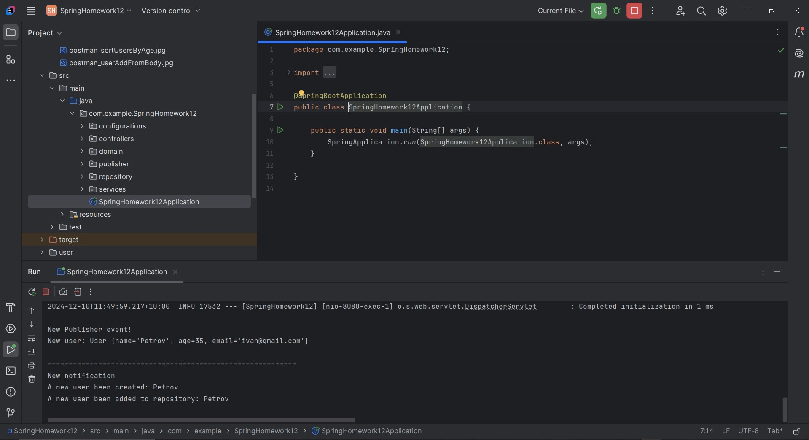

# Урок 12. Паттерны проектирования и GoF паттерны в Spring приложении

Задание: 
Продемонстрируйте использование нескольких паттернов проектирования в вашем приложении. 
Объясните, почему вы выбрали эти паттерны и как они помогают в решении конкретных проблем.

=================================================================================================

## Паттерны, использованные для примера в данном ДЗ:

* ### Repository
  обеспечивает структурированный подход к инкапсуляции логики доступа к данным и упрощению 
  взаимодействия с постоянным хранилищем;
  (изоляция логики доступа к данным)
  
* ### MessageBus на Spring Integration
  позволяет улучшить коммуникацию между компонентами системы и делает код менее связанным
  (канал сообщений о создании нового пользователя с сохранением данных в файл)

* ### Publisher/Subscribe
  полезно, когда есть несколько независимых модулей, которые должны реагировать на какие-то
  события, но при этом не должны знать друг о друге
  (вывод в консоль сообщения о новом событии - создании пользователя)

===============================================

# Демонстрация решения:

